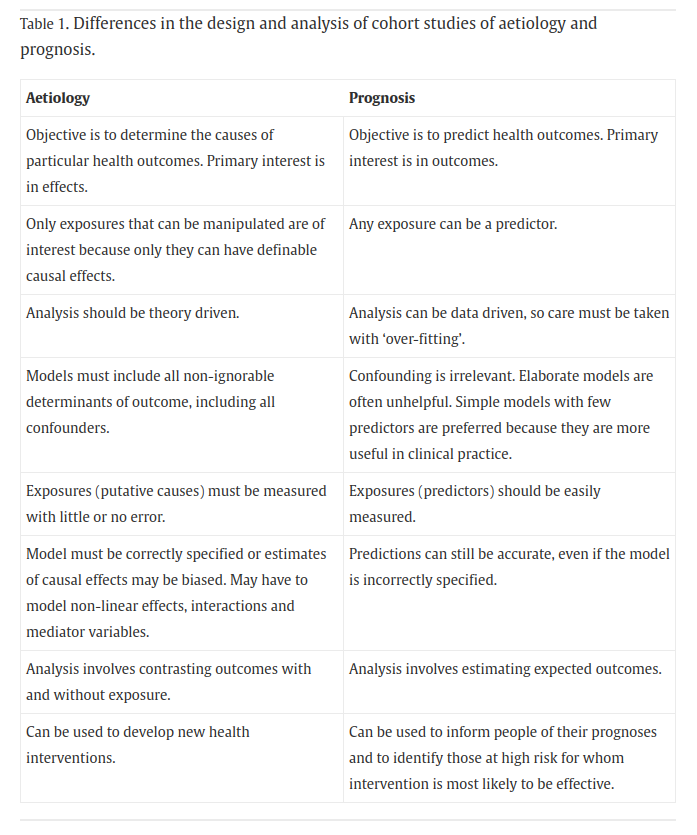
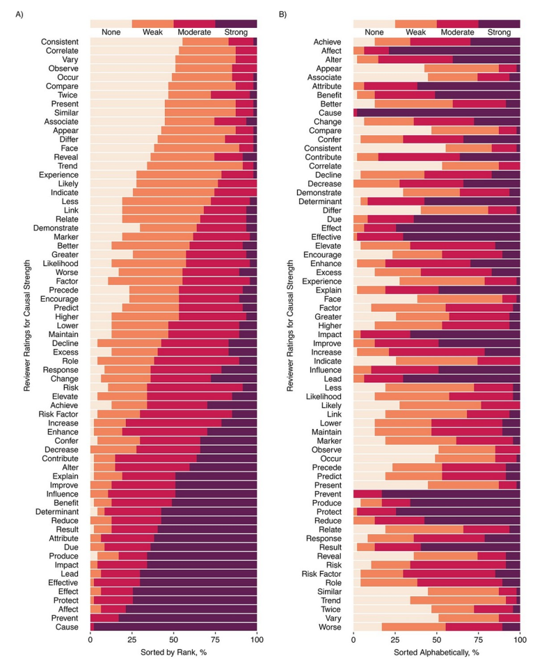

# Paper 1. Hernán MA. The C-Word: scientific euphemisms do not improve causal inference from observational data.

"The proscription against the C[ausal]-word is harmful to science because causal inference is a core task of science [in many instances],
regardless of whether the study is randomized or non-randomized."

How a research question is asked reflects its aim:

1) Do the sorts of people who drink a glass of red wine daily have lower risk of heart disease?
2) Does drinking a glass of red wine daily lower the risk of heart disease?

Q1 is interested in association. \
Q2 is interested in causation.

# Paper 1.

Being explicit about scientific aims, even when using observational data,
improves study design by helping to

* specify the exact causal effect of a research question (e.g. exposure, dose, frequency, population, etc.), which guides the analysis
* better adjust for confounding, the distorted association between variables, using subject-matter knowledge and a plausible causal structure

Even if there's no guarantee a causal model includes all confounders,
"we can [only] have an informed scientific discussion ... if we first acknowledge the causal goal of the analysis."

# Discussion

Comments or clarifications?

Does anyone disagree with Hernán (e.g. do you think using 'association'/'correlation'/'link' words are better)? Why?

How are RCTs imperfect, and how are these limitations overcome?

How else are observational data limited at allowing causal inference? Do these problems only affect observational studies?

# Paper 2. Lipsky AM, Greenland S. Causal directed acyclic graphs.

A causal directed acyclic graph

* shows direction of plausible causal effects between exposure, outcome and other variables
* has directed (e.g. E -> O, E -> M -> O) and non-directed (e.g. E <- C -> O, E -> S <- O) paths
* is complete when it includes any variable that has arrows into each possible pair of variables along paths from cause to effect

# Paper 2.

* Association flows along directed and non-directed paths
* Causal association only flows along directed paths
* To identify (then estimate) causal associations, block all non-directed (backdoor) paths
* Do this by 
  * adjusting/conditioning on confounders
  * leaving colliders alone

# Discussion

Any comments or clarifications? Terms:

* exposure/treatment
* assumption
* (statistical) adjustment/conditioning/control

Sometimes, a variable can be both a confounder and a collider. Special methods are needed to deal with this. 

Sometimes, conditioning on colliders can happen inadvertently
(e.g. loss of participants before study completion forces analysis to condition on selection of participants).
Methods are needed to deal with selection bias.

1. In practice, how do you build a DAG?
2. What have reviewers challenged when reviewing DAGs?
3. How do you know a DAG is correct?

<!--
# Paper 3. Butler et al. Upper limb function but not proprioception is impaired in essential tremor.

Causal mediation analysis is a technique to estimate to what extent the causal effect of
an exposure (treatment) on an outcome is mediated through other paths

To conduct mediation analysis, plausible causal mechanisms are specified in a causal graph,
and adjustments are made for potential confounding.

The analysis then partitions the average total effect of the exposure on outcome into an average effect acting through the mediator,
and an average direct effect.

# Paper 3.

Fig 2 of paper shows separation of the total effect of essential tremor on physical function,
into an indirect effect acting through proprioception, and a direct effect.

In this causal structure, the 2 mediators (proprioception and tremor amplitude) are causally dependent
(i.e. they are connected by an arrow)

* When mediators are causally dependent, the average causally mediated effect (ACME) assumes interactions between the primary mediator and the outcome are independent of the exposure (i.e. proprioception-function causal effects don't depend on levels of tremor)
* This assumption can't be verified using data, so
* sensitivity analyses are performed to assess, if this assumption is violated, how prone to bias the ACME is.

This study was the first causal mediation application in this field,
and was a real advance over traditional approaches using correlations to infer causation.

# Discussion

Comments or clarifications?

Interpretation of different causally mediated effects

* Average causally mediated effect (ACME):
* Average direct effect (ADE):
* Total effect:
* Average causally mediated effect in the treated (ACME treated):
* Average causally mediated effect in the control (ACME control):

What is the value of ACME control?

We used R's `multimed` function in the `mediation` package; it's stable and has good documentation \
What other approaches or software do people use? Structural equation modeling? 

# Paper 4. Herbert RD. Research Note: Causal inference.

Causal effects can be stated in terms of the potential outcomes framework (Rubin) or 
'blocking backdoor paths' to isolate/identify the causal effect (Pearl)

Individual causal effects can't be observed, but under certain (identifiability) assumptions, average causal effects can be estimated using data.

'Exchangeability' between groups (i.e. no unmeasured confounding) is an important assumption. Other assumptions are:

* causal consistency: 
* positivity: 

I.e. confounding is not the only bias.

Causal inferences can be weak or strong, depending on how valid those assumptions are

# Paper 4.

Randomisation is terrific! \ 
It generates causal effects because it breaks the confounder -> outcome path.

If randomisation is not feasible, try to approximate exchangeability (no unmeasured confounding) using
subject matter knowledge (theroy) and
good data (i.e. associations that are not or minimally subject to bias)
to specify plausible causal mechanisms in a DAG to identify the minimally-sufficient adjustment set.

Interpret effect estimates (e.g. between group differences)
as causal effects of exposure on outcome under the assumed DAG.

# Discussion

Comments or clarifications?

What other variable adjustment methods are there when a DAG is impossibly complicated (e.g. genetics data)?

* disjunctive cause criterion

# Paper 5. MacWilliams et al. Causal factors affecting gross motor function in children diagnosed with cerebral palsy.

Investigators proposed a causal model on how neurological and orthopedic impairments (exposure) affect physical function (outcome) in children with CP.
Variables were limited to those routinely collected during motion analysis of gait.

To estimate causal effects, gait analysis and muscle electromyography (cross-sectional) data from 300 consecutive children with CP were analysed.

(Multivariate) linear models were used to estimate total (direct and mediated) and direct only causal effects of each exposure on function,
using the adjustment set for that exposure. 
I.e. causal effects of motor control, strength, spasticity etc. on function were analysed in separate linear models

# Paper 5. 

A predictive model was developed to assess how well all exposures predicted function.
The model's performance on out-of-sample observations was assessed (using the same dataset?)

Measures of association (i.e. estimates from models of only 2 variables), which do not control for confounding, were obtained and compared against causal estimates.

Findings: \
All measures of association overestimated the magnitudes of causal effects.

# Discussion

Was the causal model developed using sufficient theory, if variables considered were only those that were collected?

DAG arrows indicate causes precede effects in time. This assumption is implicit if cross-sectional data are used; it can't be tested. Are the assumptions for each arrow fair?

Linear (outcome) regression alone provides the conditional effect controlling for confounding,
not the marginal causal effect.
The marginal effect is better, but you'd need to model the outcome (g-formula) or model the treatment (IPTW) to get that.

What might be the next research question? \
Refine the DAG? 

# Paper 6. Petersen and van der Laan. Causal models and learning from data.

1. Specify knowledge about the system to be studied using a causal model
2. Specify the observed data and their link to the causal model
3. Specify a target causal quantity
4. Assess identifiability
5. State the statistical estimation problem
6. Estimate
7. Interpret

# Discussion

This paper was chosen to provide a framework to articulate a causal question and answer it using statistical approaches. 

Do you think all steps in the framework exist independently, or occur simultaneously?

Are some steps more important or problematic than others?

How can language to interpret causal effects reflect the strength of scientific claims?

# Paper 7. Buzzell et al. Etiology-specific variation in survival following non-traumatic spinal cord injury.

Aimed to estimate excess deaths caused by different mechanisms of non-traumatic SCI 
(e.g. degenerative disc disorder, infection, vascular disorder, benign tumour, malignant tumour) 
from deaths caused by lesion-related (SCI severity) or demographic factors (age, sex, calendar period)
using deaths in traumatic SCI as the reference

* Exposure: SCI etiology (cause)
* Outcome: survival time
* Latent (unobserved) variable: underlying health conditions that cause (non-traumatic) SCI
* Confounders: age, sex, calendar period
* Mediator: SCI severity (included in the _total causal effect_)

# Paper 7. 

* Conditional dependencies in the fairly simple DAG were tested to confirm DAG is consistent with dataset
* Relative mortality estimated with hazard ratios
* Sensitivity analysis:
  * Compared traumatic SCi mortality caused by 'transport related' + 'sports and leisure' alone, vs these + 'falls' and 'other'
  * E-values calculated: indicates the magnitude (as risk ratio) of unmeasured confounding needed to be associated with exposure and outcome to completely explain away the causal effect; big E-value risk ratio is better 

# Discussion

Comments or clarifications?

Dashed/dotted arrows in DAG is non-standard

SCI severity is a mediator: its effect can't be teased out from total causal effect without mediation analysis

How important is it to test for conditional independencies?
(Less feasible in complex DAG, prone to Type 1 error, DAG should be based on theory not testability, testing can't externally validate DAG, RMSE hard to interpret?)

# Paper 8. Diong et al. The effect of face-to-face versus online learning on student performance in anatomy.

Aimed to estimate the causal effect of face-to-face learning on student performance in anatomy, compared to online learning,
by analysing exam marks under an assumed causal structure. Some comments:

* Provide evidence to justify DAG: reviewers will ask for it.
* The total causal effect, not the direct causal effect, is the preferred estimate: The total effect includes mediation paths, requires fewer assumptions, and is the default effect reported in the literature

# Paper 8.

* Under this DAG, the causal effect holds if the paths from COVID lockdown to end-sem exam mark are fully mitigated (blocked) by the mid-sem exam mark and feedback
* Interestingly, this mean the causal effect could only be identified (and estimated) by analysing the end-sem mark alone, not the combined mid- and end-sem mark (analysing the combined mark would bias the causal effect, under this DAG)
* ATAR scores (high school marks) are also not a confounder and should not be adjusted in the analysis
* We reported E-values for sensitivity analysis, and interpreted them in Discussion
  * This is the minimum strength of association (risk with confounding / risk without confounding) that an unmeasured confounder would need to have with an exposure and an outcome to completely explain away the exposure-outcome association, conditional on the adjusted vairables
  * E-valye of 1 == null effect == no unmeasured confounding is needed to explain away the causal effect (this is bad)

# Discussion

Comments or clarifications?

Do you believe the DAG? \
What might be the next research question for this area? \
How would you do the study better?

Any advice to gently introduce the causal framework into any field?

# Paper 9. Herbert RD. Cohort studies of aetiology and prognosis: they're different.

{ width=63% }

# Paper 9.

* An 'association' between exposure and outcome is only useful when if it is causal or predictive
* 'No causation without manipulation' means it is not possible to talk meaningfully about causal effects of an exposure unless it's clear how the exposure can be manipulated
* Theory drives analysis of aetiology by suggesting
  * plausible confounders
  * if exposure-outcome relationships may be non-linear
  * if there are interactions between exposures or
  * if exposures are mediators

# Discussion

Comments or clarifications?

How might including strong confounders in prognostic models improve generalisability? \
When is a confounder 'strong'?

Isn't the aim of prediction to estimate the expectation of the outcome in those with and without the predictor?
(Which, in causal inference, is analogous to contrasting the outcomes in those with and without the exposure)

# Paper 10. Haber et al. Causal and associational language in observational health research.

* Retrieved RCT and Obs studies from high-ranking journals in health/medicine/epidemiology
* Most interesting aims
  * To identify words used to link relationships between exposures and outcomes (e.g. 'association', 'had higher')
  * Qualitative analysed the strength of causality implied by these words

* From 1275 (1170 Obs, 105 RCTs) were assessed by 3 reviewers; There were many more observational studies
* The most common linking word in abstracts was 'association' (46%), followed by 'increase' (6%). Few studies used 'cause' (0.8%)
* More than 50% of reviewers felt the word 'associate' carried some causal implication

I.e. Using 'associate' to avoid the word 'cause' leads to more confusion in interpretation, than clarity

# Paper 10.

{ width=65% }

# Discussion

Comments or clarifications?

What do you make of the findings?

What might be the next research question? A language analysis in different fields?

-->